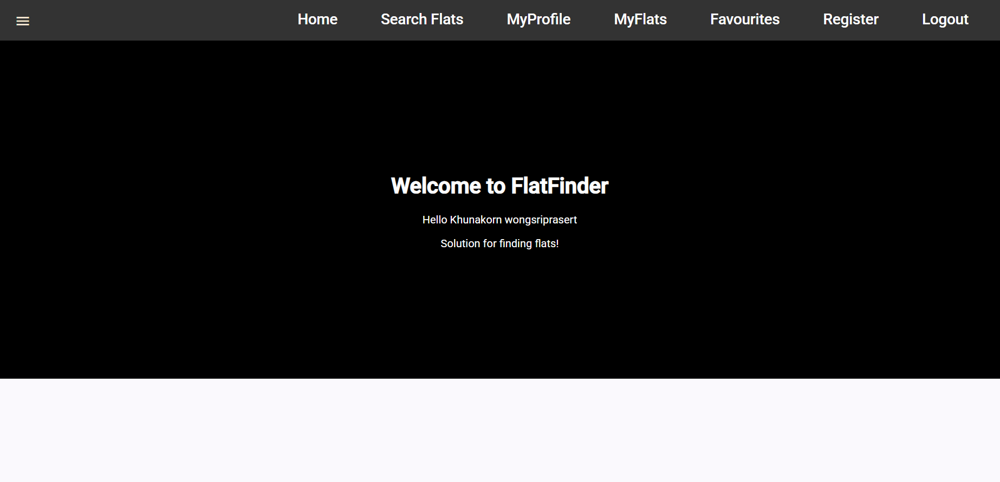

# FlatFinder

This project was generated using [Angular CLI](https://github.com/angular/angular-cli) version 19.0.4.

## Project Overview

FlatFinder is an application designed to help users search for and manage their flat listings. It includes features such as user authentication, profile management, flat search, and favoriting flats.

## Technologies Used

- Angular CLI: 19.0.4
- Firebase for authentication and Firestore
- Angular Material for UI components

## login detail
-first options: username/password: wongsriprasert@gmail.com/123456
-second option: register
## Home page



## Enabling Billing and Deploying to Firebase

To use Firebase features in production, you need to enable billing for your Firebase project. Follow these steps:

1. Go to the [Firebase Console](https://console.firebase.google.com/).
2. Select your `flatfinder-96333` project.
3. Enable billing in the **Billing** section.

### Build and Deploy

To build and deploy the project to Firebase, run:

```sh
ng build --prod
firebase deploy
```
## Development server

To start a local development server, run:

```bash
ng serve
```

Once the server is running, open your browser and navigate to `http://localhost:4200/`. The application will automatically reload whenever you modify any of the source files.

## Code scaffolding

Angular CLI includes powerful code scaffolding tools. To generate a new component, run:

```bash
ng generate component component-name
```

For a complete list of available schematics (such as `components`, `directives`, or `pipes`), run:

```bash
ng generate --help
```

## Building

To build the project run:

```bash
ng build
```

This will compile your project and store the build artifacts in the `dist/` directory. By default, the production build optimizes your application for performance and speed.

## Running unit tests

To execute unit tests with the [Karma](https://karma-runner.github.io) test runner, use the following command:

```bash
ng test
```

## Running end-to-end tests

For end-to-end (e2e) testing, run:

```bash
ng e2e
```

Angular CLI does not come with an end-to-end testing framework by default. You can choose one that suits your needs.

## Additional Resources

For more information on using the Angular CLI, including detailed command references, visit the [Angular CLI Overview and Command Reference](https://angular.dev/tools/cli) page.

